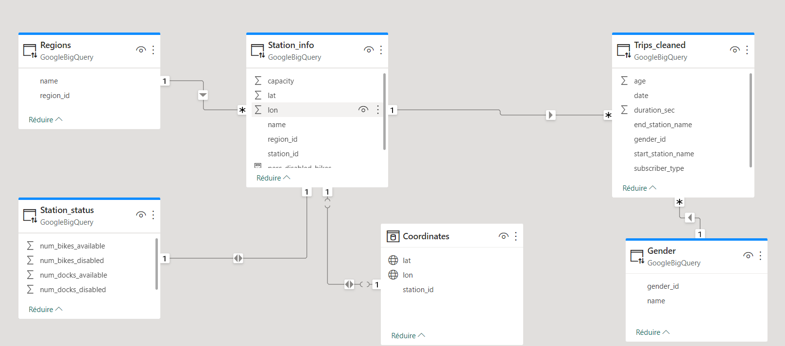

The tool will be created with Power BI. Power BI allows a connection with Google BigQuerry. You can either import data coming from big querry or use DirectQuerry option if you do not want to import the data, it is the option we will use. To update the data on the dashboard, the user has to push on the update button of power BI (Note that this update function is far from perfect and not usable for a tool in real life).

# Stuctrure the data
As told beforhand Google BigQuerry does not enable to reference tables between each other. We will us Power Bi to do it. Below lays the schema of our database, you notice that a new table appeared (coordinates). This table isn't usefull and could be deleted. I created it struggling to inform Power BI that 'lat' and 'lon' was coordinates, however since then I found a way to do it directly in the table Station_info, which would have been more efficient.

After that, some calculations and some filtering had to be done to have acceptable figures but in overall there was no major challenges.